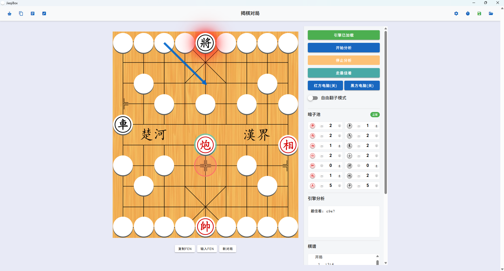

# JieqiBox

[](https://opensource.org/licenses/MIT)
[](https://discord.gg/d8HxM5Erad)

JieqiBox is a modern, cross-platform desktop application for Jieqi (揭棋) analysis and play. Built with a powerful combination of Tauri and Vue 3, it provides a comprehensive toolset for Jieqi enthusiasts and developers.

You can obtain the engine by building it from https://github.com/official-pikafish/Pikafish/tree/jieqi.



## ✨ Features

*   **Interactive Board**: A fully functional Jieqi board with complete rule validation.
*   **Engine Analysis**: Supports any UCI-protocol Jieqi engine for real-time analysis and move suggestions.
*   **FEN Compatibility**: Import and export game positions using Forsyth-Edwards Notation (FEN). The FEN format is consistent with Pikafish.
*   **Board Editor**: Visually create and edit any board position.
*   **Move History**: Tracks and displays the full history of moves in a game.
*   **Modern UI**: A clean and responsive interface built with Vue 3 and Vuetify.
*   **Multi-language Support**: Full internationalization (i18n) support with 5 languages:
    - 简体中文 (Simplified Chinese)
    - 繁體中文 (Traditional Chinese)
    - English
    - Tiếng Việt (Vietnamese)
    - 日本語 (Japanese)

## 🛠️ Tech Stack

*   **Core Framework**: [Tauri](https://tauri.app/) (Rust backend)
*   **Frontend**: [Vue 3](https://vuejs.org/) with [TypeScript](https://www.typescriptlang.org/)
*   **UI Components**: [Vuetify 3](https://vuetifyjs.com/)
*   **Styling**: [SCSS](https://sass-lang.com/)
*   **Build Tool**: [Vite](https://vitejs.dev/)
*   **Internationalization**: [Vue I18n](https://vue-i18n.intlify.dev/) for multi-language support

## 🚀 Getting Started (For Users)

The easiest way to use JieqiBox is to download the latest release for your operating system.

1.  Go to the [**Releases**](https://github.com/Velithia/JieqiBox/releases) page.
2.  Download the installer file for your platform (e.g., `.msi` for Windows, `.dmg` for macOS, or `.AppImage`/`.deb` for Linux).
3.  Run the installer and launch the application.

## 💻 Development Setup (For Developers)

If you want to contribute or run the project from the source code, follow these steps.

#### Prerequisites

First, ensure you have the necessary dependencies installed for Tauri development. You can find the official guide here:
[**Tauri Prerequisites**](https://tauri.app/v1/guides/getting-started/prerequisites/)

This typically includes **Node.js/npm** and the **Rust toolchain**.

#### Installation & Running

1.  **Clone the repository:**
    ```bash
    git clone https://github.com/Velithia/JieqiBox.git
    cd jieqibox
    ```

2.  **Install frontend dependencies:**
    ```bash
    # Using npm
    npm install
    
    # Or using yarn
    # yarn install
    ```

3.  **Run the application in development mode:**
    This command will launch the application with hot-reloading for the frontend.
    ```bash
    npm run tauri dev
    ```

## 📦 Building for Production

To build the final executable application for your platform, run the following command:

```bash
npm run tauri build
```

The compiled application will be located in the `src-tauri/target/release/bundle/` directory.

## 🤝 Contributing

Contributions are welcome! Whether you're fixing a bug, adding a new feature, or improving documentation, your help is appreciated. Please feel free to open an issue or submit a pull request.

## 📄 License

This project is licensed under the **MIT License**. See the [LICENSE](./LICENSE) file for details.
